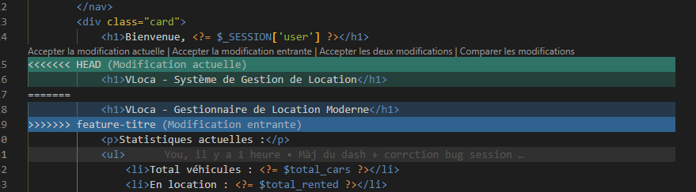
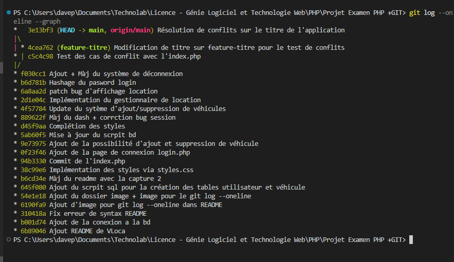

# VLoca | Gestion de Location

## Auteur

David SAYE

## Presentation du projet

VLoca est une application web PHP de gestion de location de vehicules. Le projet permet a un gestionnaire de se connecter, consulter l'etat du parc automobile, ajouter des vehicules, enregistrer des locations et suivre l'activite de l'agence depuis un tableau de bord plus professionnel.

## Objectif

L'objectif du projet est de proposer une petite application de gestion simple, claire et exploitable dans un contexte academique. Cette refonte avait pour but de rendre le site plus credible visuellement, plus fluide a utiliser et plus propre dans son organisation PHP.

## Fonctionnalites principales

- Authentification d'un utilisateur avec verification du mot de passe.
- Tableau de bord avec statistiques sur le parc et les locations.
- Ajout de vehicules avec controle des champs et prevention des doublons.
- Consultation du parc automobile avec statut et tarif journalier.
- Enregistrement d'une nouvelle location.
- Cloture d'une location pour remettre un vehicule en disponibilite.
- Messages de succes ou d'erreur pour guider l'utilisateur.

## Structure du projet

- `login.php` : page de connexion.
- `logout.php` : deconnexion de l'utilisateur.
- `index.php` : tableau de bord principal.
- `vehicules.php` : gestion du parc automobile.
- `locations.php` : gestion et suivi des locations.
- `db.php` : connexion a la base de donnees MySQL.
- `bootstrap.php` : session, securisation et fonctions utilitaires.
- `layout.php` : structure commune des pages.
- `style.css` : charte graphique de l'application.

## Technologies

- PHP
- MySQL
- HTML
- CSS

## Execution du projet

1. Creer la base de donnees `vloca`.
2. Importer `database/script.sql` dans phpMyAdmin sur la base `vloca`.
3. Verifier les identifiants de connexion dans `db.php`.
4. Lancer le projet sur un serveur local PHP ou Apache.
5. Ouvrir `login.php` dans le navigateur.

## Jeu de donnees de depart

Le script SQL fournit un utilisateur de test et quelques vehicules de demonstration pour visualiser directement le dashboard et les locations.

- Identifiant : `david`
- Mot de passe : `password`

## Bilan

Cette refonte transforme un site assez basique en une mini application de gestion plus presentable pour un examen ou une demonstration. Le projet reste volontairement simple, mais il propose maintenant une interface plus serieuse, une meilleure experience utilisateur et une logique PHP plus fiable.

## Annexes Git

### Historique

### Operations sur les branches

### Conflit entre branches

### Graphe des commits

